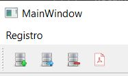
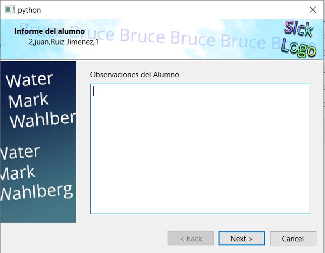
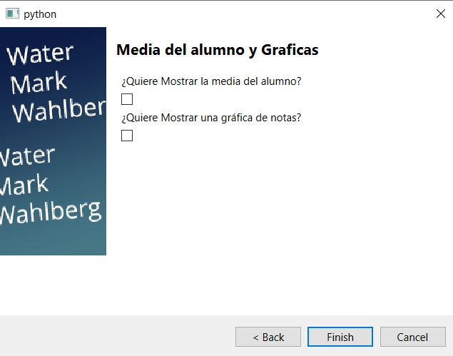

author: Marcelo
summary: CReacion de un informe mediante wizard
id: Trabajo6-MSM
categories: codelab,markdown
environments: Web
status: Published
feedback link: Un enlace en el que los usuarios puedan darte feedback (quizás creando un issue en un repositorio de git)

# Trabajo6

## Introducción
Duration: 0:02:00

```Primero pulsaremos el botón de la derecha, previamente pulsando en algún alumno de la tabla.```



## Primera página
Duration: 0:01:00


```Luego podremos poner las observaciones del alumno```



## Segunda página
Duration: 0:01:00

```Por ultimo habrá dos checkbox que nos permitiran calcular la nota media y incrustarla en forma de gráfica ```

### Opciones

* Media General
* Gráfica
  
  
* 
